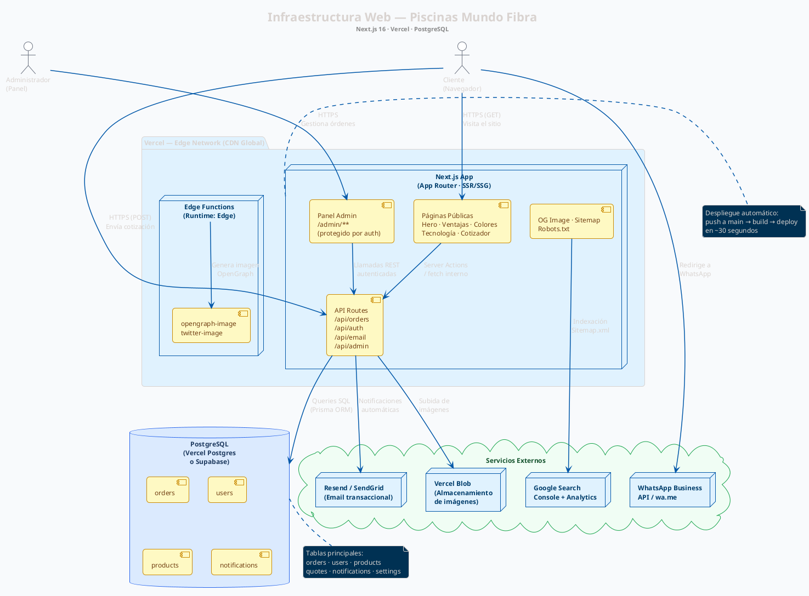
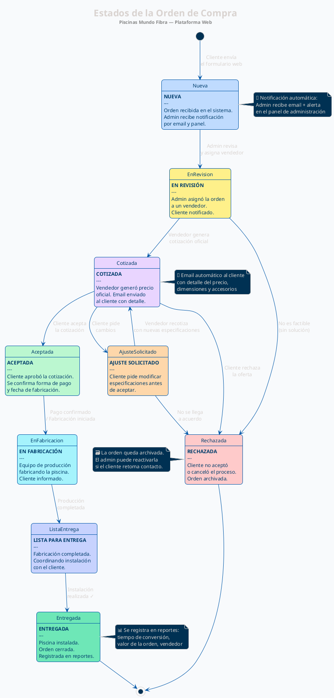
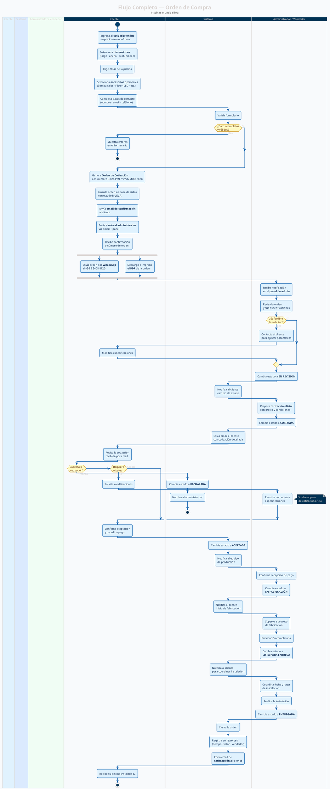

# Diagramas PlantUML — Piscinas Mundo Fibra

Pega cada bloque en [https://www.plantuml.com/plantuml/uml](https://www.plantuml.com/plantuml/uml) o usa la extensión **PlantUML** de VS Code para previsualizar.

---

## 1. Diagrama de Infraestructura

---

## 2. Diagrama de Estados — Orden de Compra

---

## 3. Diagrama de Flujo — Orden de Compra (Activity)

---

## Cómo usar estos diagramas

### Opción A — Online (sin instalación)
1. Ir a [plantuml.com/plantuml/uml](https://www.plantuml.com/plantuml/uml)
2. Pegar el contenido de cada bloque (sin las comillas del markdown)
3. El diagrama se renderiza automáticamente

### Opción B — VS Code
1. Instalar la extensión **PlantUML** (`jebbs.plantuml`)
2. Instalar Java (requerido por PlantUML)
3. Abrir un archivo `.puml` y presionar `Alt + D` para previsualizar

### Opción C — Exportar como PNG/SVG
En la web de PlantUML, usa los botones **PNG** o **SVG** para descargar la imagen del diagrama lista para incluir en presentaciones o documentos.
