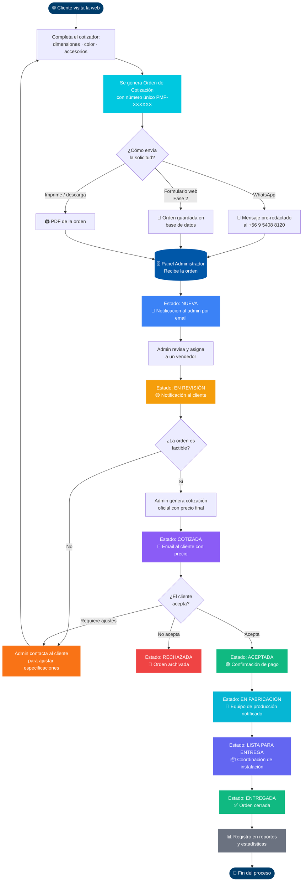

# Propuesta de Desarrollo Web
## Piscinas Mundo Fibra

---

**Preparada por:** Equipo de Desarrollo  
**Fecha:** Abril 2026  
**Versión:** 1.0

---

## Resumen Ejecutivo

Se propone el desarrollo de una plataforma web profesional para **Piscinas Mundo Fibra**, que permita a la empresa gestionar cotizaciones, órdenes de compra y clientes directamente desde la web, sin depender de herramientas externas. El proyecto contempla dos fases: la primera ya ejecutada como demostración, y la segunda correspondiente al desarrollo completo de la plataforma.

**Inversión total:** $1.200.000 CLP  
**Duración estimada:** 8 semanas  
**Tecnología:** Next.js · TypeScript · Tailwind CSS · PostgreSQL · Vercel

---

## Lo que ya está construido (Fase 1 — Demo)

Esta primera versión fue desarrollada para mostrar al cliente la visión del producto y validar el diseño antes de comprometer la inversión completa.

| Módulo | Descripción | Estado |
|---|---|---|
| Sitio web público | Página de inicio moderna con identidad de marca | ✅ Listo |
| Sección Ventajas | 8 ventajas de las piscinas de fibra con iconos | ✅ Listo |
| Sección Tecnología | Visualización de las 4 capas multicapa | ✅ Listo |
| Sección Colores | Paleta de 6 colores disponibles | ✅ Listo |
| Cotizador online | Formulario con dimensiones, color y accesorios | ✅ Listo |
| Orden de compra | Documento generado automáticamente con número único | ✅ Listo |
| Integración WhatsApp | Botón flotante + envío de cotización pre-redactada | ✅ Listo |
| SEO completo | Sitemap, robots.txt, JSON-LD, OpenGraph, Twitter Cards | ✅ Listo |
| Despliegue en Vercel | Configuración lista para publicar en producción | ✅ Listo |

> Esta demo funcional demuestra la calidad y dirección del proyecto. Sin embargo, **no cuenta con base de datos, administrador ni gestión real de órdenes**.

---

## Lo que falta por desarrollar (Fase 2 — Plataforma Completa)

### Módulo 1 — Autenticación y Perfiles de Usuario
- Sistema de login seguro (email + contraseña, recuperación)
- Roles diferenciados: **Administrador**, **Vendedor** y **Cliente**
- Panel de perfil editable (nombre, empresa, teléfono, contraseña)
- Registro de clientes desde el cotizador público

### Módulo 2 — Panel de Administración
- Dashboard con métricas: cotizaciones del día, órdenes pendientes, clientes nuevos
- Gestión de usuarios (crear, editar, desactivar)
- Vista general de actividad reciente

### Módulo 3 — Gestión de Órdenes de Compra
- Listado completo de órdenes con filtros por estado, fecha y cliente
- Estados del flujo: `Nueva → En revisión → Cotizada → Aceptada → En fabricación → Entregada`
- Asignación de órdenes a vendedores
- Generación y descarga de PDF profesional de la orden
- Historial de cambios por orden (auditoría)

### Módulo 4 — Gestión del Catálogo
- ABM de modelos de piscinas (nombre, dimensiones, descripción, fotos)
- Gestión de colores disponibles
- Gestión de accesorios con precios referenciales
- Galería de imágenes administrable

### Módulo 5 — Notificaciones y Correo
- Configuración del correo destinatario desde el panel (sin tocar código)
- Plantillas de email editables: bienvenida, nueva cotización, cambio de estado
- Notificación automática al cliente cuando su orden cambia de estado
- Notificación al administrador por cada nueva cotización recibida

### Módulo 6 — Administrador SEO
- Editor de metadatos por sección: título, descripción, palabras clave
- Control de Open Graph (título e imagen para redes sociales)
- Previsualización de cómo aparece la web en Google
- Integración con Google Search Console para monitoreo de posicionamiento

### Módulo 7 — Configuración General del Sitio
- Datos de contacto editables (teléfono, WhatsApp, email, redes sociales)
- Textos del sitio editables sin necesidad de programación
- Activar/desactivar secciones de la página pública
- Configuración del banner/hero (texto, color de fondo, imagen)

### Módulo 8 — Reportes y Exportación
- Reporte de cotizaciones por período
- Reporte de clientes y conversiones
- Exportación a Excel/CSV
- Gráficos simples de evolución mensual

---

## Plan de Trabajo y Cronograma

| Semana | Trabajo a Realizar |
|:---:|---|
| **1** | Base de datos (PostgreSQL), autenticación, roles y middleware de seguridad |
| **2** | Panel de administración: dashboard, gestión de usuarios y perfil |
| **3** | Módulo de órdenes de compra: listado, estados, asignación y auditoría |
| **4** | Generación de PDF profesional, notificaciones por email y configuración SMTP |
| **5** | Módulo de catálogo: modelos, colores, accesorios y galería de imágenes |
| **6** | Módulo SEO administrable + configuración general del sitio |
| **7** | Reportes, exportación y ajustes de rendimiento |
| **8** | Pruebas finales, correcciones, despliegue en producción y capacitación |

**Fecha de inicio estimada:** Acuerdo firmado + pago del 50% por adelantado  
**Entrega estimada:** 8 semanas desde el inicio

---

## Justificación del Precio

### Desglose por módulo

| Módulo | Horas estimadas | Valor hora (CLP) | Subtotal |
|---|:---:|:---:|---:|
| Fase 1 (Demo ya construida) | 20 hrs | $15.000 | $300.000 |
| Autenticación + Perfiles | 15 hrs | $15.000 | $225.000 |
| Panel de administración | 12 hrs | $15.000 | $180.000 |
| Gestión de órdenes + PDF | 18 hrs | $15.000 | $270.000 |
| Catálogo + galería | 10 hrs | $15.000 | $150.000 |
| Correo + notificaciones | 8 hrs | $15.000 | $120.000 |
| SEO administrable | 6 hrs | $15.000 | $90.000 |
| Configuración general | 5 hrs | $15.000 | $75.000 |
| Reportes + exportación | 7 hrs | $15.000 | $105.000 |
| Despliegue, pruebas y capacitación | 8 hrs | $15.000 | $120.000 |
| **Total estimado** | **109 hrs** | | **$1.635.000** |
| **Precio ofertado** | | | **$1.200.000** |
| **Descuento aplicado** | | | -$435.000 |

> El precio de **$1.200.000 CLP** representa un **descuento del 27%** sobre el costo real de desarrollo, aplicado por ser el proyecto inicial con este cliente, con expectativa de relación comercial a largo plazo (mantenimiento, actualizaciones, hosting).

### ¿Por qué vale este precio?

- **No es un sitio estático:** Es una plataforma con lógica de negocios, base de datos, múltiples perfiles y flujos de trabajo reales.
- **Tecnología moderna:** Construida con Next.js 16, TypeScript y desplegada en Vercel — la misma infraestructura que usan empresas como Airbnb y TikTok.
- **Optimizada para Google desde el día 1:** Incluye SEO técnico completo (Schema.org, sitemap, Open Graph) que normalmente se cobra por separado.
- **Ahorra tiempo y dinero al cliente:** Gestionar órdenes por WhatsApp es ineficiente y no escalable. Esta plataforma centraliza todo, reduce errores y mejora la imagen profesional.
- **Soporte y capacitación incluidos:** La última semana incluye pruebas y una sesión de capacitación para que el equipo de Piscinas Mundo Fibra opere la plataforma de forma autónoma.

---

## Diagrama de Flujo — Orden de Compra

El siguiente diagrama describe el ciclo de vida completo de una orden de compra dentro de la plataforma, desde que el cliente cotiza en la web hasta la entrega final de la piscina.

### Estados de la Orden

| Estado | Color | Descripción | Quién actúa |
|---|:---:|---|---|
| 🔵 **Nueva** | Azul | Orden recibida, pendiente de revisión | Sistema |
| 🟡 **En revisión** | Amarillo | Admin o vendedor está analizando la solicitud | Administrador |
| 🟣 **Cotizada** | Morado | Se envió precio oficial al cliente | Administrador |
| 🟢 **Aceptada** | Verde | Cliente aceptó la cotización | Cliente |
| 🔷 **En fabricación** | Celeste | Piscina en proceso de producción | Equipo de producción |
| 🔹 **Lista para entrega** | Índigo | Fabricación completada, pendiente instalación | Logística |
| ✅ **Entregada** | Verde oscuro | Proceso finalizado | Sistema |
| 🔴 **Rechazada** | Rojo | Cliente no aceptó o canceló | Cliente / Admin |

### Notificaciones automáticas del sistema

Cada cambio de estado dispara una notificación automática:

- **Cliente:** recibe email en cada transición de estado relevante
- **Administrador:** recibe alerta en el panel + email por cada orden nueva
- **Vendedor asignado:** recibe notificación al asignársele una orden
- **WhatsApp:** el botón de contacto directo está siempre disponible en todas las etapas

---

## Condiciones Comerciales

| Concepto | Detalle |
|---|---|
| **Precio total** | $1.200.000 CLP (IVA incluido) |
| **Forma de pago** | 50% al inicio ($600.000) · 50% al entregar ($600.000) |
| **Plazo de entrega** | 8 semanas desde la confirmación y pago inicial |
| **Revisiones incluidas** | Hasta 2 rondas de ajustes por módulo |
| **Capacitación** | 1 sesión online de uso del panel de administración |
| **Dominio y hosting** | No incluido (se asesora en la contratación, costo aprox. $5.000-$15.000 CLP/mes en Vercel) |
| **Mantenimiento posterior** | Cotización separada según necesidades |

---

## Próximos Pasos

1. **Revisión de esta propuesta** con el cliente
2. **Firma de acuerdo** de trabajo y alcance
3. **Pago del 50%** para iniciar el desarrollo
4. **Kick-off** — reunión de inicio para confirmar prioridades y accesos
5. **Entregas semanales** para revisión y feedback del cliente

---

*Para consultas o ajustes a esta propuesta, contáctenos directamente.*

